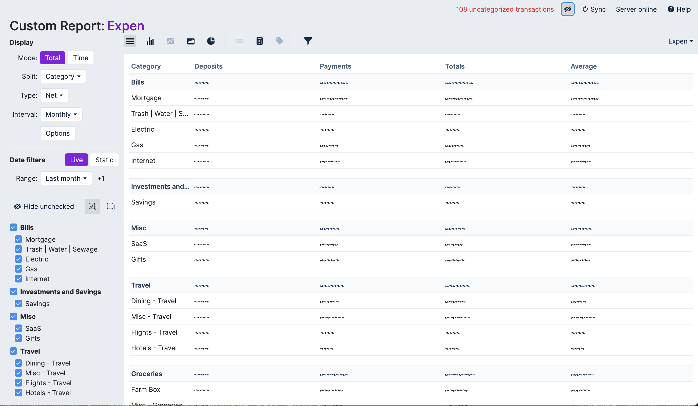

# Actual Utils
Takes copied and pasted data from an Actual Budget Report Screen and returns a ordered CSV



## Quick Start

```
node ./src/index.mjs ./example/input.txt ./example/order.txt
``` 

## Usage

### Create an `input.txt` file
   Copy and paste the table from your actual budget report screen (see setting below) into this file. You should end up with something that looks like `./example/input.txt`

### Create an `order.txt` file. 
This is the desired order of your output. See `./example/order.txt`

### Run it
```
node ./src/index
```  
_Note: optionally you can provide file name arguments (see quick start)_

You will be warned if your order and inputs don't match

### See output
A file with today's date will be written to the output directory

## Actual Report Settings
Table Type: Data Table  
Mode: Total  
Split: Category  
Type: Net  
Interval: Any  
Options: All on 
